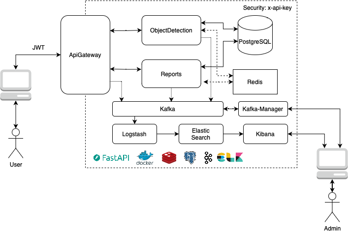

# Microservice Architecture

## Overview

This project shows the implementation of a microservice architecture using an object detection app.

This project uses the following architecture:

<center>

<br>
<em>Figure 1. Microservice Architecture</em>
</center>

## Table of Content

## Pre-requisites

## Quickstart

The fastest way to get started is to use docker-compose:

- Make DB migrations:

```
docker-compose --profile migration up
```

- Start dev environment:

```
docker-compose --profile dev up
```

This spawns various containerized microservices.

It should now be possible to access a web frontend at:

```
http://localhost:8080/
```

A REST API at:

```
http://localhost:8000/docs
```
